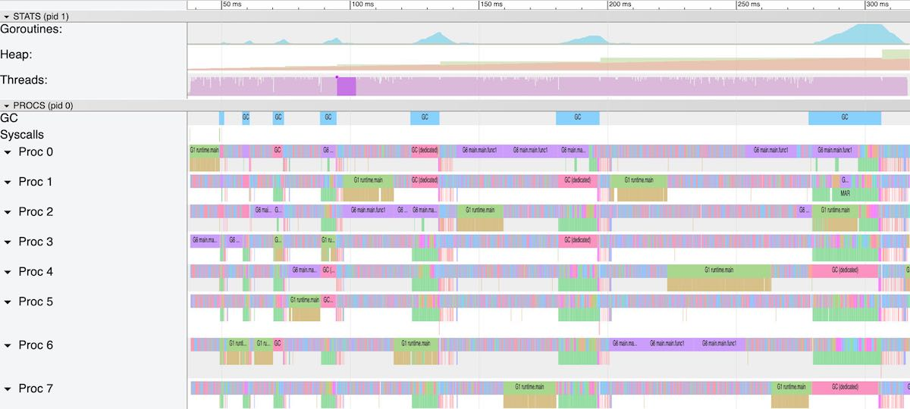
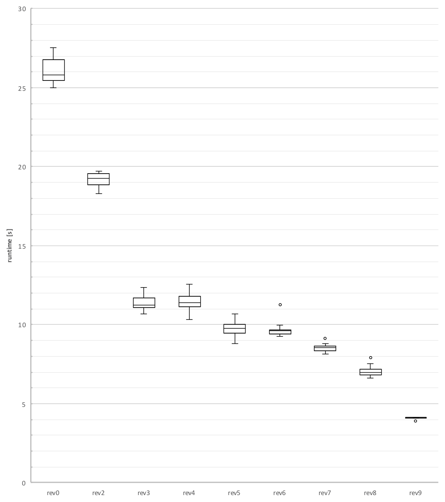

# Processing Large Files – Java, Go and 'hitting the wall'


In January Stuart Marks published a blog post named [“Processing Large Files in Java”](https://stuartmarks.wordpress.com/2019/01/11/processing-large-files-in-java/) as a response to a post by Paige Niedringhaus about [“Using Java to Read Really, Really Large Files”](https://itnext.io/using-java-to-read-really-really-large-files-a6f8a3f44649). Niedringhaus there reports her experience with [JavaScript](https://developer.mozilla.org/en-US/docs/Web/JavaScript) to solve a “coding challenge” where a “very large file” has to be processed and four specific questions where asked about the processed file. After solving the challenge in JavaScript, Niedringhaus then moved forward and successfully implemented a solution to the challenge in [Java](https://openjdk.java.net/) as she was curious about Java and how to do it in that language.

This article starts where Marks left and tries to improve on the performance aspect of the code further; until we [*hit the wall*](https://marcellanz.com/post/file-read-challenge/#conclusion-hitting-the-wall).

# Objectives

In this article we discover how to implement a challenges solution in [Go](https://golang.org/) and then **increase performance by 650% going below 4 seconds** from 25 seconds, which is over 20x improvement from the challenges original version of 84 seconds over the course of 9 revisions. We’ll also have a look at performance limiting aspects of this challenge.

Performance is our priority for now. Marks and others pointed out that code quality can be equally important. Thats very true and Niedringhaus’s first implementation was “just” about how to solve the challenge and not about performance; that became a focus when other solutions where available to her. For a program to run such a long time, nearly one an a half minute, it is a valid thing to measure its performance and then compare it to the code that lead to this perfomance. With that measurement we can at least quantify *a quality* of the code.

But lets first get an overview about the challenge, have a short look at two existing implementations and then create a first port of the fastest of those implementations to Go.

# The Challenge

The mission statement of the challenge is written as

> **c1** – Write a program that will print out the total number of lines in the file.

> **c2** – Notice that the 8th column contains a person’s name. Write a program that loads in this data and creates an array with all name strings. Print out the 432nd and 43243rd names.

> **c3** – Notice that the 5th column contains a form of date. Count how many donations occurred in each month and print out the results.

> **c4** – Notice that the 8th column contains a person’s name. Create an array with each first name. Identify the most common first name in the data and how many times it occurs.

(we name the challenges here to make them referenceable later)

The dataset to be processed is freely available data about “Campain Finance Election Contributions by individuals” provided by the [U.S. Federal Elections Commission](https://www.fec.gov/campaign-finance-data/contributions-individuals-file-description/) and about 3.3GB in size uncompressed.

# Baseline – 7 Iterations in Java

In his article, Marks takes the opportunity to analyse Niedringhaus' Java implementation and “focus on changing aspects of the computation to improve runtime performance” and also to “present some interesting opportunities for optimizations and use of newer APIs”. Overall, Marks establishes a performance baseline for his environment, transforms the given Java programm using his knowledge of Java and reduces the programs runtime by factor of about 3.4x from 108 seconds down to 32 seconds in the course of seven iterations.

After reading Marks article I started to think of how to implement that challenges solution in Go and where we can go in terms of its performance.

Before we start, we set ourselves a baseline by executing the existing implementations given by Niedringhaus and Marks and run them on our environment, a [2017 MacBookPro (Model 14,3, I7-7920HQ)](https://everymac.com/systems/apple/macbook_pro/specs/macbook-pro-core-i7-3.1-15-mid-2017-retina-display-touch-bar-specs.html) laptop.

| Author       | Implementation                                               | Duration [s] | VM Version                          |
| :----------- | :----------------------------------------------------------- | :----------: | :---------------------------------- |
| Niedringhaus | [Java – BufferedReader](https://github.com/paigen11/read-file-java/blob/master/src/main/java/com/example/readFile/readFileJava/ReadFileJavaApplicationBufferedReader.java) |      84      | openjdk version “11.0.2” 2019-01-15 |
| Marks        | [Java – Variation7](https://gist.githubusercontent.com/stuart-marks/65d372083c21f2edeac01a58e00faf1d/raw/46d4b416bf6b6c8175aadb4be3ec5095ff7fcc57/ReadFileJavaApplicationBufferedReader7.java) |      23      | openjdk version “11.0.2” 2019-01-15 |

The dataset was taken at the 4th of January 2019 and has 18'245'416 lines of ASCII text data. Its SHA1 sum is: 0093f547b28f6c897c81bc3865b28a723a497847.

> Check also [Implementations of Others](https://marcellanz.com/post/file-read-challenge/#b1-other-implementations) that where done after Marks' initial post and after I started with my article. These articles are interesting for their comparing runtime but also for their differences in methods, libraries and languages they used for their implementation.

# 9 Revisions in Go

After setting up the baseline for performance comparisons we port Marks' fastest implementation and then go through nine revisions of Go code. During these revisions we’ll find interesting aspects that influence the performance in terms of their runtime as well as of their memory-consumption and -behaviour.

I don’t keep it back that we’re driven by plain performance interests at first, making this thing as fast as possible[.](https://github.com/chrislgarry/Apollo-11/blob/master/Luminary099/BURN_BABY_BURN--MASTER_IGNITION_ROUTINE.agc#L159) On the way down to low single digit seconds performance we take different roads of techniques available only to get to a point where we “hit the wall” and get some surprising insights whats happening there. Stay tuned!

# Revision 0 – A Go Port

[readfile0.go](https://github.com/marcellanz/file-read-challenge-go/blob/master/rev0/readfile0.go) is a straightforward port from Variation7 in Java to Go. We use no external libraries throughout this article. For certain constructs we don’t have a library or utility like [Java’s Stream utilities](https://docs.oracle.com/en/java/javase/11/docs/api/java.base/java/util/stream/package-summary.html) at all, so we have to implement them using Go’s builtin types or the [standard library](https://golang.org/pkg/#stdlib).

For this challenge the given solution can be divided into three sections

- opening the file and defining variables and lists
- reading the file and processing it line by line
- calculate and report what was found

In the first section, `Lines 17–28`, we define all [lists](https://golang.org/ref/spec#Slice_types) and variables needed to collect data in section 2. Then we use Go’s [bufio.Scanner](https://golang.org/pkg/bufio/#Scanner) to read and tokenize the given file line by line. We also use a regexp here to parse firstnames in the 8th column of the line.

The 2nd section, `Lines 31–48`, first parses the whole name from column 8 using [strings.SplitN](https://golang.org/pkg/strings/#SplitN) and then appends it to the names list. If we find a first name with the regexp it is also collected to the firstNames list. Last, we take the 5th column and parse it as a year-month string (“2017-10”) and append it to the dates list.

After all lines are processed, the third section, `Lines 50-83`, then analyses and reports according to the challenges given tasks (c1-c4). Reporting *c1: total number of lines* of the processed file is easy. Then as the challenges *c2* states, we have to report three names at the indexes 0, 432 and 43243. Next a [frequency table](https://en.wikipedia.org/wiki/Frequency_distribution) of the donations has to be made by each month over the years.

The Java implementation uses a sequence of stream processing utilities (java.util.stream.Collectors.[groupingBy(…)](https://marcellanz.com/post/file-read-challenge/"https://docs.oracle.com/en/java/javase/11/docs/api/java.base/java/util/stream/Collectors.html#groupingBy(java.util.function.Function)")) that we don’t have in Go to get the donation dates frequencies. Instead we use a map of strings to ints and count up donation dates occurrences by iterating over the dates list and report them according to *c3*. Last, for *c4*, the most common donators firstname has to be reported. Similarly to the donations dates, we use a map of strings to integers and iterate over the firstnames found in section two. During that process we note the most common name and its count that then gets reported.

- [readfile0.go](https://marcellanz.com/post/file-read-challenge/#code_rev0-0)
- [Lines 17–28](https://marcellanz.com/post/file-read-challenge/#code_rev0-1)
- [Lines 31–48](https://marcellanz.com/post/file-read-challenge/#code_rev0-2)
- [Lines 50–83](https://marcellanz.com/post/file-read-challenge/#code_rev0-3)

```go
 1package main
 2
 3import (
 4	"bufio"
 5	"fmt"
 6	"log"
 7	"os"
 8	"path/filepath"
 9	"regexp"
10	"strings"
11	"time"
12)
13
14func main() {
15	start := time.Now()
16
17	file, err := os.Open(os.Args[1])
18	if err != nil {
19		log.Fatal(err)
20	}
21	defer file.Close()
22
23	firstNamePat := regexp.MustCompile(", \\s*([^, ]+)")
24	names := make([]string, 0)
25	firstNames := make([]string, 0)
26	dates := make([]string, 0)
27	commonName := ""
28	commonCount := 0
29
30	scanner := bufio.NewScanner(file)
31	for scanner.Scan() {
32		text := scanner.Text()
33
34		// get all the names
35		split := strings.SplitN(text, "|", 9) // 10.95
36		name := strings.TrimSpace(split[7])
37		names = append(names, name)
38
39		// extract first names
40		if matches := firstNamePat.FindAllStringSubmatch(name, 1); len(matches) > 0 {
41			firstNames = append(firstNames, matches[0][1])
42		}
43
44		// extract dates
45		chars := strings.TrimSpace(split[4])[:6]
46		date := chars[:4] + "-" + chars[4:6]
47		dates = append(dates, date)
48	}
49
50	// report c2: names at index
51	fmt.Printf("Name: %s at index: %v\n", names[0], 0)
52	fmt.Printf("Name: %s at index: %v\n", names[432], 432)
53	fmt.Printf("Name: %s at index: %v\n", names[43243], 43243)
54	fmt.Printf("Name time: %v\n", time.Since(start))
55
56	// report c1: total number of lines
57	fmt.Printf("Total file line count: %v\n", len(names))
58	fmt.Printf("Line count time: : %v\n", time.Since(start))
59
60	// report c3: donation frequency
61	dateMap := make(map[string]int)
62	for _, date := range dates {
63		dateMap[date] += 1
64	}
65	for k, v := range dateMap {
66		fmt.Printf("Donations per month and year: %v and donation count: %v\n", k, v)
67	}
68	fmt.Printf("Donations time: : %v\n", time.Since(start))
69
70	// report c4: most common firstName
71	nameMap := make(map[string]int)
72	ncount := 0 // new count
73	for _, name := range firstNames {
74		ncount = nameMap[name] + 1
75		nameMap[name] = ncount
76		if ncount > commonCount {
77			commonName = name
78			commonCount = ncount
79		}
80	}
81
82	fmt.Printf("The most common first name is: %s and it occurs: %v times.\n", commonName, commonCount)
83	fmt.Printf("Most common name time: %v\n", time.Since(start))
84	fmt.Fprintf(os.Stderr, "revision: %v, runtime: %v\n", filepath.Base(os.Args[0]), time.Since(start))
85}
```

Source code is presented from now on always in their entire length but accomodated by snippets of lines and also a *diff-file*. Sometimes and where applicable lines are highlighted. Unfortunately the Highlighter I use here has a bug, an Go code sometimes is slightly wrong intended, especially after line-comments

## Revision 0 – Performance

Lets run this first revision and see how it performs.

```
$ go run rev0/readfile0.go itcont.txt
Most common name time: 24.976828s
$
```

Just below 25 seconds, that’s interesting! Lets see how the output compares to Variation7.

- [Go - Revision 0](https://marcellanz.com/post/file-read-challenge/#run_rev0-0)
- [Java - Variation 7](https://marcellanz.com/post/file-read-challenge/#run_rev0-1)

```go
 1Name: PEREZ, JOHN A at index: 0
 2Name: MILESKI, JOHN A at index: 432
 3Name: COX, JOHN MARTIN at index: 43243
 4Name time: 29.957748306s
 5Total file line count: 18245416
 6Line count time: 29.957770809s
 7Donations per month and year: 2018-10 and donation count: 2615902
 8Donations per month and year: 2018-04 and donation count: 3033610
 9Donations per month and year: 2018-06 and donation count: 496569
10Donations per month and year: 2018-02 and donation count: 765317
11Donations per month and year: 2017-08 and donation count: 298740
12Donations per month and year: 2017-12 and donation count: 486447
13Donations per month and year: 2018-07 and donation count: 1105070
14Donations per month and year: 2018-09 and donation count: 1264597
15Donations per month and year: 2018-11 and donation count: 302025
16Donations per month and year: 2017-02 and donation count: 36367
17Donations per month and year: 2017-03 and donation count: 78664
18Donations per month and year: 2017-10 and donation count: 585708
19Donations per month and year: 2018-05 and donation count: 533304
20Donations per month and year: 2018-01 and donation count: 1252689
21Donations per month and year: 2017-07 and donation count: 768051
22Donations per month and year: 2017-09 and donation count: 377544
23Donations per month and year: 2018-03 and donation count: 271267
24Donations per month and year: 2017-06 and donation count: 180699
25Donations per month and year: 2017-11 and donation count: 346019
26Donations per month and year: 2017-01 and donation count: 21
27Donations per month and year: 2017-05 and donation count: 197636
28Donations per month and year: 2017-04 and donation count: 254810
29Donations per month and year: 2018-12 and donation count: 2259957
30Donations per month and year: 2018-08 and donation count: 733865
31Donations per month and year: 2019-01 and donation count: 538
32Donations time: 30.339466074s
33The most common first name is: JOHN and it occurs: 475350 times.
34Most common name time: 33.686980274s
```

We get the same output regarding its format. And with 25 seconds we’re 8% slower than Variation7.

Lets close this section of the first revision for now. We will now go through several steps of optimization (and sometimes non-optimization) and try to get as low as possible from a performance perspective.

At the end I’ll present performance data for all revisions [in detail](https://marcellanz.com/post/file-read-challenge/#performance-runs-details). For each revision the revisions best runtime will be noted so we get an indication where we are. Beside plain runtime we’ll also inspect the total memory allocation as we as the allocated heap- and system memory.

# A Plan to Go Forward

With Revision 0 we are 8% slower than the run-time of Variation7. One can say that readline0.go is a fairly simple and readable Go program. It is implemented in one function, like its predecessors, and has a simple linear non-parallel structure. There is no explicit parallelism or concurrency going on during its runtime (actually the GC is doing its work concurrently but thats out of our [control](https://github.com/golang/go/blob/release-branch.go1.12/src/runtime/mgc.go#L7) for now).

> **Concurrency in Go** – When Go [entered the attention](https://www.youtube.com/watch?v=jgVhBThJdXc) of the programming language and computing communities, it was presented as a [simple](https://talks.golang.org/2015/simplicity-is-complicated.slide#1) and programming efficiency oriented langugage. It also had some features to be prepared for the then coming multi-core environments. Coming from Google and with its concept of goroutines and channels backed right into the language (inspired by Tony Hoares [Communicating Sequential Processes](https://en.wikipedia.org/wiki/Communicating_sequential_processes), CSP) it was ready to be a language for a network-computing oriented audience (The term *Cloud* then was not invented yet). Concurrency is and was a thing for Go, [not parallelism](https://blog.golang.org/concurrency-is-not-parallelism). Concurrency in Go is more like a tool to structural composition, not doing stuff in parallel even it it can be used to do that.

Why talking about concurrency and parallelism here? Sometimes Go newcomers tend to improve lacking performance by using Go’s *goroutines* and *channels* just to get better performance. Programmers from other languages do the same and “go parallel” using multi-threading to get work distributed to their multicore CPUs. There is nothing wrong by doing more work at the same time, but it can lead to other problems when the communication overhead kicks in and [limits its intended performance gain](https://en.wikipedia.org/wiki/Amdahl's_law). Writing this, we now will go ahead and kind of naively apply Go’s concurrency features to our problem; and see what happens.

# Revision 1 – A Naive Performance Improvement

If we think about the structure of our challenges solution, where could we improve performance? We read lines of data, process them, store them in lists and then process them to get a report. So if we try to process these parts of our programs structure in parallel, why not use Go’s goroutines and let them communicate through channels. This is what we try to do with Revision 1 – [readfile1.go](https://github.com/marcellanz/file-read-challenge-go/blob/master/rev1/readfile1.go)

- start a goroutine reading from three channels `nameC, lastnameC, datesC` to append lists
- for each line, start a goroutine for every line and parse 3 fields to send them over to one of these three channels
- wait until all goroutines are finished
- report according to the challenges rules (c1-c4)

After reading a line of the dataset, we start a goroutine `Lines 59-76` where we parse the three fields we’re interested in (name, lastname, donation date) and send those fields over to a concurrently runnning goroutine `Lines 34-54` which collects those fields and appends them to their corresponding lists.

- [Lines 59-76](https://marcellanz.com/post/file-read-challenge/#rev1-0)
- [Lines 34-54](https://marcellanz.com/post/file-read-challenge/#rev1-1)
- [readfile1.go](https://marcellanz.com/post/file-read-challenge/#rev1-2)
- [diff -u rev0.go rev1.go](https://marcellanz.com/post/file-read-challenge/#rev1-3)

```go
59		go func() {
60			// get all the names
61			split := strings.SplitN(text, "|", 9)
62			name := strings.TrimSpace(split[7])
63			namesC <- name
64
65			// extract first names
66			if matches := firstNamePat.FindAllStringSubmatch(name, 1); len(matches) > 0 {
67				firstNamesC <- matches[0][1]
68			} else {
69				wg.Add(-1)
70			}
71
72			// extract dates
73			chars := strings.TrimSpace(split[4])[:6]
74			date := chars[:4] + "-" + chars[4:6]
75			datesC <- date
76		}()
```

We decouple the part where we read lines of text from the parts where these lines are processsed and then the data is collected. The decoupling is done by issuing goroutines and connect them back using channels. When layed out to multiple CPU cores the following could happen by reading lines and processing them concurrently on other cores

```
CPU-0: [read line1][read line2][read line3]
CPU-1:             [process line1]         [process line3]
CPU-2:                         [process line2]
```

which is obiviously more efficient than

```
CPU-0: [read line1][process line1][read line2][process line2][read line3][process line3]
```

Lets run Revision 1 and see how it performs.

## Performance

Running Revision 1 we get

```
$ go run rev1/readfile1.go itcont.txt
Most common name time: 732s
$
```

Thats over 12 minutes! I ran it a 2nd time and it took even longer. What happens here?

We fired off a goroutine that receives names, firstnames and dates from three channels and then for every line of text parsed we spun off an another goroutine and sent over names, firstnames and dates. Thats over 18 million goroutines feeding one other goroutine through three channels and therefore 3x18 million = 54 million messages over those three channels.

```
send name      -> [ nameC      ] --\ 
send firstName -> [ firstNameC ] --- -> select() one -> [ append one to a list ]
send date      -> [ datesC     ] --/ 
```

While we ran Revision 1 the CPU cores where highly saturated with “work”. For every line we fire up a goroutine then gets running and distributed over to all available cores. But it seems that the overhead of communication in relation to the small part of parsing a line into three data fields (firstname, lastname, date) is high and we end up waiting over 12 minutes to get completed.

There is one detail about Channels that also plays against us. Channels, at least non-buffered ones with a capacity of 1, do block when messages are sent to them. A Channel [is blocked](https://golang.org/ref/spec#Channel_types) until the receiving end of it reads the message. The *for - select* construct seen here is a well known pattern to *select over* multiple channels and receive from one of them when available.

This way, the sending goroutines have to wait until the draining Channel is receiving the message, either a name, a firstname or a date. This produces a substantional amount of [contention](https://en.wikipedia.org/wiki/Resource_contention).

## Go Tracer

Lets run Revision1 with Go’s Tracer [enabled](https://golang.org/pkg/runtime/trace/#Start) and [see](https://golang.org/cmd/trace/) what happens with all those goroutines.

```
$ ./bin/rev1 data/indiv18/itcont_1e6.txt 2> rev1.trace
Most common name time: 9.761422905s
$ go tool trace rev1.trace
2019/03/21 22:15:28 Parsing trace...
2019/03/21 22:16:29 Splitting trace...
2019/03/21 22:18:47 Opening browser. Trace viewer is listening on http://127.0.0.1:58572
$
```

We run a subset of 1 million lines of data of the full dataset to trace what happens in this revision to shorten the runtime a bit. It runs for just under 10 seconds. If we extrapolate that to the full dataset, we would run for 18 x 10s = 180s but it seems over the whole dataset the contention we experience gets a whole lot worse.

We inspect the first 10 seconds and therefore a million lines of data are processed and 3 million messages are sent over the three channels. We can’t display the whole tracing time with the Go Tracer as it has too many data points. The browser that is used to visualise would just blow up with its memory used. The Tracer will provide links of consecutive segements of about 100-300ms depending on the traces density.

What we see in these Tracer logs are two goroutines, one reading lines and starting goroutines and one receiving messages and then a million of line parsing goroutines that get split up into three pieces whenever they send a message to a channel. When we pick one of the ~120ms in the beginning of the trace, we see excactly that. The goroutine G1 issues systemcalls to read the file and then start the line processing goroutine. Then a goroutine called G6 that represents the for-select loop to drain messages from one of these channels and append the data to one of the lists.

Picking a tracer segment from the middle or end of the trace log, we see that the file reading goroutine is not running anymore and G6 is just there to pick up any waiting gorutines receiving their messages (G6 waits in [`runtime.selectgo()`](https://github.com/golang/go/blob/release-branch.go1.12/src/runtime/select.go#L105)). All CPU cores are saturated with mostly just waiting to get messages from these waiting goroutines. This then sums up to the 12minutes we measured. (For a more detailed description of the Tracer, see [Appendix B4](https://marcellanz.com/post/file-read-challenge/#b4-gc-tracer-in-detail))

- [~50ms - 300ms](https://marcellanz.com/post/file-read-challenge/#rev1_tracer-0)
- [~180ms – 220ms](https://marcellanz.com/post/file-read-challenge/#rev1_tracer-1)



If we are right and the channels have to wait for their receiving end to read the messages, we should also find that goroutines are split up into three pieces most of the time. They split when we send a message to one of the three channels as a concurrently running goroutine with our line parsing because Go is scheduling goroutines at points where it is very likely that a goroutine will wait and an another goroutine could be scheduled to run.

```go
62		go func() {
63			// get all the names
64			split := strings.SplitN(text, "|", 9) // 10.95
65			name := strings.TrimSpace(split[7])
66			namesC <- name
67
68			// extract first names
69			if matches := firstNamePat.FindAllStringSubmatch(name, 1); len(matches) > 0 {
70				firstNamesC <- matches[0][1]
71			} else {
72				wg.Add(-1)
73			}
74
75			// extract dates
76			chars := strings.TrimSpace(split[4])[:6]
77			date := chars[:4] + "-" + chars[4:6]
78			datesC <- date
79		}()
```

At each point, Go schedules the goroutine if the receiving end is not ready to receive our value. There is a high probability that the receiving end is not ready for our very current value. Other goroutines are doing the same, and the one receiving goroutine *G6* has to select from all other waiting goroutines doing the same.

## Revision 1 – Conclusion

I think it was a silly idea to kick off a goroutine for every line we process and even sillier to send then three times of that amount messages to three channels over to an another goroutine. But even if silly, its an explanatory example of what not to do. And for this it was worth and educating to see what happens then.

# Revision 2 – Channels Reduced

So Go’s concurrency utilities applied to a problem does not help as we learned it quite fast. With Revision2 – [readfile2.go](https://github.com/marcellanz/file-read-challenge-go/blob/master/rev2/readfile2.go) – we try to reduce the overhead of communication over the three channels. We introduce a type named `entry` that combines the name, firstname and donation date into a struct. Also we embedd a reference to a [`sync.WaitGroup`][go_sync_waitgroup] which helps us to have some kind of bookkeeping of where we are with our concurrent processing of such entries `Lines 30-37`. [go_sync_waitgroup]:https://golang.org/pkg/sync/#WaitGroup

Next, we allocate a slice of strings to buffer a chunk of lines and then process them using a goroutine. We try to find a good chunk-size for this and select 64k lines. So instead of starting a new goroutine fo every line, we do that for every 64k lines. A line is then parsed into a entry struct and sent over to a collecting goroutine over 1 channel `Lines 55-85`.

- [Lines 30-37](https://marcellanz.com/post/file-read-challenge/#rev2-0)
- [Lines 55-85](https://marcellanz.com/post/file-read-challenge/#rev2-1)
- [readfile2.go](https://marcellanz.com/post/file-read-challenge/#rev2-2)
- [diff -u readfile1.go readfile2.go](https://marcellanz.com/post/file-read-challenge/#rev2-3)

```go
30	type entry struct {
31		firstName string
32		name      string
33		date      string
34		wg        *sync.WaitGroup
35	}
36	entries := make(chan entry)
37	wg := sync.WaitGroup{}
```

## Performance

```
$ go run rev2/readfile2.go itcont.txt
Most common name time: 18.28508803s
$
```

With 18.2 seconds for this revision, we’re 6.8 seconds below our first revision. Thats a wooping -27% or 1.36x.

The trace log shows what we might expect. A goroutine reads lines of data and hands them over in chunks where they are parsed and for each line an entry of our three data fields are composed and then, entry by entry, sent over a channel to a collecting goroutine. We’re now concurrent, but the CPU cores still not working for us.

# Revision 3 – Multiple Entries to Send

With [readfile3.go](https://github.com/marcellanz/file-read-challenge-go/blob/master/rev3/readfile3.go) lets reduce the overhead for communication over channels even further and for every 64k chunk of lines, we collect the same amount of entries into a slice and send them over the entries channel `entriesC`. Our channel is now a channel of a slice of entries `Lines 30-83`.

- [Lines 30-83](https://marcellanz.com/post/file-read-challenge/#rev3-0)
- [readfile3.go](https://marcellanz.com/post/file-read-challenge/#rev3-1)
- [diff -u readfile2.go readfile3.go](https://marcellanz.com/post/file-read-challenge/#rev3-2)

```go
30type entry struct {
31     firstName string
32     name      string
33     date      string
34     wg        *sync.WaitGroup
35 }
36  entriesC := make(chan []entry)
37  wg := sync.WaitGroup{}
38  go func() {
39     for {
40         select {
41         case entries, ok := <-entriesC:
42             if ok {
43                    for _, entry := range entries {
44                     if entry.firstName != "" {
45                         firstNames = append(firstNames, entry.firstName)
46                     }
47                     names = append(names, entry.name)
48                     dates = append(dates, entry.date)
49                     entry.wg.Done()
50                 }
51              }
52         }
53     }
54 }()
55  linesChunkLen := 64 * 1024
56 lines := make([]string, 0, 0)
57 scanner.Scan()
58 for {
59     lines = append(lines, scanner.Text())
60     willScan := scanner.Scan()
61     if len(lines) == linesChunkLen || !willScan {
62         toProcess := lines
63         wg.Add(len(toProcess))
64         go func() {
65              entries := make([]entry, 0, len(toProcess))
66              for _, text := range toProcess {
67                 // get all the names
68                 e := entry{wg: &wg}
69                 split := strings.SplitN(text, "|", 9)
70                 name := strings.TrimSpace(split[7])
71                 e.name = name
72                 // extract first names
73                 if matches := firstNamePat.FindAllStringSubmatch(name, 1); len(matches) > 0 {
74                     e.firstName = matches[0][1]
75                 }
76                 // extract dates
77                 chars := strings.TrimSpace(split[4])[:6]
78                 e.date = chars[:4] + "-" + chars[4:6]
79                    entries = append(entries, e)
80              }
81                entriesC <- entries
82          }()
83         lines = make([]string, 0, linesChunkLen)
```

## Performance

```
$ go run ./rev3/readfile3.go
Most common name time: 10.66832747s
$
```

Here we go: 10.66 seconds. We’re down another 8 seconds or -42%, which is quite a lot. We see less goroutines running in general. The CPU cores are still well used and 6-7 goroutines are constantly `Running`. Revision 3 is what we planned to do, reading lines and hand them over to process them on a dedicated goroutine. With this plan, we got a reduction of 60% from our port, Revision 0.

# Revision 4 – Hang in on a Mutex

In this revision – [readfile4.go](https://github.com/marcellanz/file-read-challenge-go/blob/master/rev4/readfile4.go) – we still build up chunks of parsed lines as entries, but we don’t share them over a channel to get them appended to our three lists. Instead we inline the lists appending into our loop and protect this code section with a [`sync.Mutex`](https://golang.org/pkg/sync/#Mutex). Here we remove one instance of resource contention. Instead of having chunks of entries sent over a channel and get processed on the other end by a collecting goroutine, we wait, through a call to `mutex.Lock()` until we can enter the section of code to append the parsed entries to the three lists `Lines 65-74`.

- [Lines 65-74](https://marcellanz.com/post/file-read-challenge/#rev4-0)
- [readfile4.go](https://marcellanz.com/post/file-read-challenge/#rev4-1)
- [diff -u readfile3.go readfile4.go](https://marcellanz.com/post/file-read-challenge/#rev4-2)

```go
65				mutex.Lock()
66				for _, entry := range entries {
67					if entry.firstName != "" {
68						firstNames = append(firstNames, entry.firstName)
69					}
70					names = append(names, entry.name)
71					dates = append(dates, entry.date)
72				}
73				wg.Add(-len(entries))
74				mutex.Unlock()
```

As we can see here, we don’t need a channel to share our data to get finally be collected. Our goroutine can wait, with its collected data, on a mutex until the mutex is free. Then the goroutine is just parked in memory until it is scheduled to proceed. Go is well prepared for such a scenario as explained in [`sync/mutex.go`](https://github.com/golang/go/blob/release-branch.go1.12/src/sync/mutex.go#L44). Instead of, that the data is waiting to get drained on a channel and then appended to a list, our processing goroutine is waiting until it can append the parsed data to those lists itself.

## Performance

```
$ go run ./rev4/readfile4.go
Most common name time: 10.31209465s
$
```

The CPU cores are still well used as we’re having 6 goroutines running at a time. With this revision the compository structure of code by an explicit channel is gone. We didn’t gain much, but we keep this revisions changes for now.

# Revision 5 – Inside the Loop

When we inspect the run-times, we can see that different sections take different run times.

```
Donations per month and year: 2018-08 and donation count: 733865
Donations per month and year: 2018-10 and donation count: 2615902
Donations per month and year: 2017-05 and donation count: 197636
Donations time: : 10.371920253s
The most common first name is: JOHN and it occurs: 475350 times.
Most common name time: 12.296942248s
```

Here, between donations time and common name time, we take about 2 seconds to *range over* the firstNames slice and find the most common name. Lets try to bring both of them, the donations frequency table and the commons name counting into our parsing loop. So after we parsed our lines into entries, when appending to the lists, we update the date frequencies and common name counting right inside the loop `Lines 68-81`. This way, we don’t have to loop over those two maps, we should gain some seconds this way – [readfile5.go](https://github.com/marcellanz/file-read-challenge-go/blob/master/rev5/readfile5.go)

- [Lines 68-81](https://marcellanz.com/post/file-read-challenge/#rev5-0)
- [readfile5.go](https://marcellanz.com/post/file-read-challenge/#rev5-1)
- [diff -u readfile4.go readfile5.go](https://marcellanz.com/post/file-read-challenge/#rev5-2)

```go
68				for _, entry := range entries {
69					if entry.firstName != "" {
70						firstNames = append(firstNames, entry.firstName)
71						 nameCount := nameMap[entry.firstName]
72						nameMap[entry.firstName] = nameCount + 1
73						if nameCount+1 > commonCount {
74							commonName = entry.firstName
75							commonCount = nameCount + 1
76						}
77					}
78					names = append(names, entry.name)
79					dates = append(dates, entry.date)
80					dateMap[entry.date]++
81				}
```

## Performance

```
$ go run ./rev5/readfile5.go
Most common name time: 8.781626047s
$
```

And we get an another 1.5 seconds and break the 10 seconds mark for the first time.

Whats happening here? I suspect that the code section where we append parsed data to our lists, is not fully saturating the time that is available to run this code section in relation to everything thats going on elsewhere. Instead of waste this time during the parsing and then serially take time to loop over the maps and do the calculation of the frequency table and the most common name, we place this code inside the loop.

> One might come to think about how well that scales with possible future requirements by what we did in Revision 5. In a future challenge or with changing requirements, it could be that placing this code inside the loop has negative consequences regardig its performance. A reasonable point. But we’re here also *to perform* and these numbers don’t lie when it comes to quantify performance. I don’t say that I’m a supporter of this in all instances in terms of *code quality*, but we still have some fun here, right?

# Revision 6 – Reuse Allocated Memory

Until now we followed no methodical approach to improve our performance. Some claim (also Marks in his article) to have enough experience to come up with good enough ideas to improve performance of a short enough piece of code. And to be honest, I did the same throughout these iterations; without profiling, I decided to apply a method or tool in terms of language- or library features only on my own or out of curiousity. Brendan Gregg defined this as the *Streetligh Anti-Method* in his book [*Systems Performance: Enterprise and the Cloud*](http://www.brendangregg.com/sysperfbook.html). To improve performance or the try of it by applying stuff you heard of might work, is exactly that.

> **Streetlight Anti-Method** – This method is actually the absence of a deliberate methodology. The user analyzes performance by choosing observability tools that are familiar, found on the Internet, or just at random to see if anything obvious shows up. This approach is hit or miss and can overlook many types of issues.

> – Gregg, B. *Systems Performance: Enterprise and the Cloud*. Prentice Hall, 2013

So lets use a [`sync.Pool`](https://golang.org/pkg/sync/#Pool) just out of curiosity of what happens `Lines 39-53`. In our code we allocate slices of lines and slices of entries where we then collect lines of data and then entries of parsed fields. Allocating these 64k-sized slices over and over again might have a negative effect on our performance, right? With a `sync.Pool` we can re-use allocated slices and making re-allocation unnecessary. Beside the allocation of the slices itself, whenever we append an element to a slice where its capacity is not sufficient, Go grows these slices by a [growing factor](https://go.googlesource.com/go/+/refs/tags/go1.12.1/src/runtime/slice.go#76) of 2 for capacities less than 1024 and by 1.25 above – [readfile6.go](https://github.com/marcellanz/file-read-challenge-go/blob/master/rev6/readfile6.go)

Until now we allocated line- and entry-slices with a starting capacity of 0. It might be beneficial to allocate them with the `linesChunkLen` size to where we will grow for sure during the processing of a 64k chunk of lines `Lines 64-102`.

- [Lines 39-53](https://marcellanz.com/post/file-read-challenge/#rev6-0)
- [Lines 64-102](https://marcellanz.com/post/file-read-challenge/#rev6-1)
- [readfile6.go](https://marcellanz.com/post/file-read-challenge/#rev6-2)
- [diff -u readfile5.go readfile6.go](https://marcellanz.com/post/file-read-challenge/#rev6-3)

```go
39	linesChunkLen := 64 * 1024
40	linesChunkPoolAllocated := int64(0)
41	linesPool := sync.Pool{New: func() interface{} {
42		lines := make([]string, 0, linesChunkLen)
43		atomic.AddInt64(&linesChunkPoolAllocated, 1)
44		return lines
45	}}
46	lines := linesPool.Get().([]string)[:0]
47
48	entriesPoolAllocated := int64(0)
49	entriesPool := sync.Pool{New: func() interface{} {
50		entries := make([]entry, 0, linesChunkLen)
51		atomic.AddInt64(&entriesPoolAllocated, 1)
52		return entries
53	}}
```

## Performance

```
$ go run ./rev6/readfile6.go
Most common name time: 9.235948927s
$
```

There seems to be no immediate benefit using a `sync.Pool` to reuse previously allocated slices. Comparing memory allocation `TotalAlloc` for Revision 5 and 6, we can see a reduction of 1.1GiB less memory allocated during its runtime.

```
rev5: Alloc = 7072 MiB  TotalAlloc = 17216 MiB  Sys = 8007 MiB  NumGC = 22
rev6: Alloc = 5155 MiB  TotalAlloc = 16125 MiB  Sys = 7679 MiB  NumGC = 27
```

So there is a benefit, but we don’t measure it in terms of runtime performance. We even loose 0.5 seconds in runtime for the fastest measured time. But if we look closer, the average runtime of revision 5 and revision 6 are very similar

```
#       Min           Avg           SD            TotalAlloc
rev5    8.781626047   9.765141717   0.425628359   17216
rev6    9.235948927   9.651679988   0.421454038   16125
```

We keep this optimisation to the next round.

# Revision 7: Regexp Usage

[readfile7.go](https://github.com/marcellanz/file-read-challenge-go/blob/master/rev7/readfile7.go) – Regexp engine implementations are [precious machines](https://swtch.com/~rsc/regexp/). Some say Go’s regexp implementaion is not the [fastest](https://github.com/golang/go/issues/26623) and indeed having seen Go’s performance in the field vs. Java like in this benchmarksgame where [Go’s is about 3x slower than Java](https://benchmarksgame-team.pages.debian.net/benchmarksgame/performance/regexredux.html) supports this opinion.

So lets have a look at our regexp, they are always interesting. I’m not an expert in the matter but lets try to improve here a bit.

We used

```
// FindAllStringSubmatch is the 'All' version of FindStringSubmatch; it
// returns a slice of all successive matches of the expression, as defined by
// the 'All' description in the package comment.
// A return value of nil indicates no match.
func (re *Regexp) FindAllStringSubmatch(s string, n int) [][]string
```

which seems to be a bad choice of what we actually need. What we’re looking for is to get the first word after a lastname separated by a comma and a whitespace.

```
"PEREZ, JOHN A"
"DEEHAN, WILLIAM N"
"WATJEN, THOMAS R."
"SABOURIN, JAMES"
```

Here we’re looking for `JOHN`, `WILLIAM`, `THOMAS` and `JAMES`. We also have a capturing group in the regexp which brings a performance penalty generally.

> Typically, non-capturing groups perform better than capturing groups, because they require less allocation of memory, and do not make a copy of the group match

> StackOverflow 33243292

- [diff -u readfile6.go readfile7.go](https://marcellanz.com/post/file-read-challenge/#rev7-0)
- [readfile7.go](https://marcellanz.com/post/file-read-challenge/#rev7-1)

```go
 1--- rev6/readfile6.go	2019-03-31 17:20:27.000000000 +0200
 2+++ rev7/readfile7.go	2019-03-31 17:25:05.000000000 +0200
 3@@ -20,7 +20,7 @@
 4 	}
 5 	defer file.Close()
 6 
 7-	firstNamePat := regexp.MustCompile(", \\s*([^, ]+)")
 8+	firstNamePat := regexp.MustCompile(", \\s*[^, ]+")
 9 	names := make([]string, 0)
10 	firstNames := make([]string, 0)
11 	dates := make([]string, 0)
12@@ -71,8 +71,8 @@
13 					entry.name = name
14 
15 					// extract first names
16-					if matches := firstNamePat.FindAllStringSubmatch(name, 1); len(matches) > 0 {
17-						entry.firstName = matches[0][1]
18+					if matched := firstNamePat.FindString(name); matched != "" {
19+						entry.firstName = matched[2:]
20 					}
21 					// extract dates
22 					chars := strings.TrimSpace(split[4])[:6]
```

We don’t need the capturing group as we don’t have to reference to the found group later. So lets get rid of them and also use the simpler [`regexp.FindString()`](https://golang.org/pkg/regexp/#Regexp.FindString)

```
// FindString returns a string holding the text of the leftmost match in s of the regular
// expression. If there is no match, the return value is an empty string,
// but it will also be empty if the regular expression successfully matches
// an empty string. Use FindStringIndex or FindStringSubmatch if it is
// necessary to distinguish these cases.
func (re *Regexp) FindString(s string) string
```

## Performance

```
$ go run ./rev7/readfile7.go
Most common name time: 8.155115627s
$
```

With the simpler regexp we are down another second.

# Revision 8: No Regexp

Next, we eliminate our regular expression. Splitting a string by a comma and then find the first word could not be that complicated. Lets do it *manually* – [readfile8.go](https://github.com/marcellanz/file-read-challenge-go/blob/master/rev8/readfile8.go).

- [diff -u readfile7.go readfile8.go](https://marcellanz.com/post/file-read-challenge/#rev8-0)
- [readfile8.go](https://marcellanz.com/post/file-read-challenge/#rev8-1)

```go
 1--- rev7/readfile7.go	2019-03-31 17:25:05.000000000 +0200
 2+++ rev8/readfile8.go	2019-03-31 17:32:46.000000000 +0200
 3@@ -5,7 +5,6 @@
 4 	"fmt"
 5 	"log"
 6 	"os"
 7-	"regexp"
 8 	"strings"
 9 	"sync"
10 	"sync/atomic"
11@@ -20,7 +19,6 @@
12 	}
13 	defer file.Close()
14 
15-	firstNamePat := regexp.MustCompile(", \\s*[^, ]+")
16 	names := make([]string, 0)
17 	firstNames := make([]string, 0)
18 	dates := make([]string, 0)
19@@ -71,8 +69,16 @@
20 					entry.name = name
21 
22 					// extract first names
23-			if matched := firstNamePat.FindString(name); matched != "" {
24-				entry.firstName = matched[2:]
25+			if name != "" {
26+				startOfName := strings.Index(name, ", ") + 2
27+				if endOfName := strings.Index(name[startOfName:], " "); endOfName < 0 {
28+					entry.firstName = name[startOfName:]
29+				} else {
30+					entry.firstName = name[startOfName : startOfName+endOfName]
31+				}
32+				if strings.HasSuffix(entry.firstName, ",") {
33+					entry.firstName = strings.Replace(entry.firstName, ",", "", -1)
34+				}
35 			}
36 			// extract dates
37 			chars := strings.TrimSpace(split[4])[:6]
```

## Performance

```
$ go run ./rev8/readfile8.go
Most common name time: 6.644675587s
$
```

Another 1.5 seconds down. Thats awesome, isn’t it?

> To peel off one second for the processing of those 18.2 million lines of data, we have to save 55ns for every line. Since we are down to a few seconds runtime even these small improvements pay off. In this case we improved by over 20%.

# Revision 9 – Reduce the Garbage

When we look about how much memory our program allocates during its runtime we are down to 11.2GiB now. Thats 3.4 times the size of the file we read through. For sure we have to read at least every byte of our file but we allocate over three times of that memory. Beside the allocation that needs the memory management of the Go runtime involved it also means that Go’s Garbage Collector has to clean up memory that is allocated temporarily and not part of the results lists.

```
rev8: Alloc = 5788 MiB    TotalAlloc = 11217 MiB    Sys = 7116 MiB    NumGC = 18
```

With the next step – [readfile9.go](https://github.com/marcellanz/file-read-challenge-go/blob/master/rev9/readfile9.go) – we try to reduce the allocate memory or not even allocate memory where it hasn’t to be allocated at all. First, we get rid of our names list; we report the requested indexes right in the loop. We also parse the donations date not as a string, and most important, we don’t slice and combine it to a dash separated `year-month` string. Instead we parse the given year and month part of the string as an integer. That fits well into our requirements. We can, later still reformat the few dozens or so dates into a format that is better suited to read. The challenge does not require a specific format, so we can leave them right in this more efficient format.

- [readfile9.go](https://marcellanz.com/post/file-read-challenge/#rev9-0)
- [diff -u readfile8.go readfile9.go](https://marcellanz.com/post/file-read-challenge/#rev9-1)

```go
  1package main
  2
  3import (
  4	"bufio"
  5	"fmt"
  6	"log"
  7	"os"
  8	"strconv"
  9	"strings"
 10	"sync"
 11	"sync/atomic"
 12	"time"
 13)
 14
 15func main() {
 16	start := time.Now()
 17	file, err := os.Open(os.Args[1])
 18	if err != nil {
 19		log.Fatal(err)
 20	}
 21	defer file.Close()
 22
 23	commonName := ""
 24	commonCount := 0
 25	scanner := bufio.NewScanner(file)
 26	nameMap := make(map[string]int)
 27	dateMap := make(map[int]int)
 28
 29	namesCounted := false
 30	namesCount := 0
 31	fileLineCount := int64(0)
 32
 33	type entry struct {
 34		firstName string
 35		name      string
 36		date      int
 37	}
 38
 39	linesChunkLen := 64 * 1024
 40	linesChunkPoolAllocated := int64(0)
 41	linesPool := sync.Pool{New: func() interface{} {
 42		lines := make([]string, 0, linesChunkLen)
 43		atomic.AddInt64(&linesChunkPoolAllocated, 1)
 44		return lines
 45	}}
 46	lines := linesPool.Get().([]string)[:0]
 47
 48	entriesPoolAllocated := int64(0)
 49	entriesPool := sync.Pool{New: func() interface{} {
 50		entries := make([]entry, 0, linesChunkLen)
 51		atomic.AddInt64(&entriesPoolAllocated, 1)
 52		return entries
 53	}}
 54	mutex := &sync.Mutex{}
 55	wg := sync.WaitGroup{}
 56
 57	scanner.Scan()
 58	for {
 59		lines = append(lines, scanner.Text())
 60		willScan := scanner.Scan()
 61		if len(lines) == linesChunkLen || !willScan {
 62			linesToProcess := lines
 63			wg.Add(len(linesToProcess))
 64			go func() {
 65				atomic.AddInt64(&fileLineCount, int64(len(linesToProcess)))
 66				entries := entriesPool.Get().([]entry)[:0]
 67				for _, text := range linesToProcess {
 68					// get all the names
 69					entry := entry{}
 70					split := strings.SplitN(text, "|", 9)
 71					entry.name = strings.TrimSpace(split[7])
 72
 73					// extract first names
 74					if entry.name != "" {
 75						startOfName := strings.Index(entry.name, ", ") + 2
 76						if endOfName := strings.Index(entry.name[startOfName:], " "); endOfName < 0 {
 77							entry.firstName = entry.name[startOfName:]
 78						} else {
 79							entry.firstName = entry.name[startOfName : startOfName+endOfName]
 80						}
 81						if cs := strings.Index(entry.firstName, ","); cs > 0 {
 82							entry.firstName = entry.firstName[:cs]
 83						}
 84					}
 85					// extract dates
 86					entry.date, _ = strconv.Atoi(split[4][:6])
 87					entries = append(entries, entry)
 88				}
 89				linesPool.Put(linesToProcess)
 90				mutex.Lock()
 91				for _, entry := range entries {
 92					if len(entry.firstName) != 0 {
 93						nameCount := nameMap[entry.firstName] + 1
 94						nameMap[entry.firstName] = nameCount
 95						if nameCount > commonCount {
 96							commonCount = nameCount
 97							commonName = entry.firstName
 98						}
 99					}
100					if namesCounted == false {
101						if namesCount == 0 {
102							fmt.Printf("Name: %s at index: %v\n", entry.name, 0)
103						} else if namesCount == 432 {
104							fmt.Printf("Name: %s at index: %v\n", entry.name, 432)
105						} else if namesCount == 43243 {
106							fmt.Printf("Name: %s at index: %v\n", entry.name, 43243)
107							namesCounted = true
108						}
109						namesCount++
110					}
111					dateMap[entry.date]++
112				}
113				mutex.Unlock()
114				entriesPool.Put(entries)
115				wg.Add(-len(entries))
116			}()
117			lines = linesPool.Get().([]string)[:0]
118		}
119		if !willScan {
120			break
121		}
122	}
123	wg.Wait()
124
125	// report c2: names at index
126	fmt.Printf("Name time: %v\n", time.Since(start))
127
128	// report c1: total number of lines
129	fmt.Printf("Total file line count: %v\n", fileLineCount)
130	fmt.Printf("Line count time: %v\n", time.Since(start))
131
132	// report c3: donation frequency
133	for k, v := range dateMap {
134		fmt.Printf("Donations per month and year: %v and donation ncount: %v\n", k, v)
135	}
136	fmt.Printf("Donations time: %v\n", time.Since(start))
137
138	// report c4: most common firstName
139	fmt.Printf("The most common first name is: %s and it occurs: %v times.\n", commonName, commonCount)
140	fmt.Printf("Most common name time: %v\n", time.Since(start))
141}
```

To be honest, our little small 81 lines Go program of revision 0 has mutated into a little monster of 141 lines of code. But lets measure its performance now.

## Performance

```
$ go run ./rev9/readfile9.go
Most common name time: 3.880034076s
$
```

With that last changes we are below 4 seconds. That’s over 20 seconds less than where we started and over 80 seconds less than the initial solution. What have we done 80 seconds long?

With this revision we’re able to process 4.7 million lines per second. The first revision did 0.73 million lines and the initial original solution to the challenge less than a third of that, 0.217 million lines/second.

```
rev9: Alloc = 81 MiB          TotalAlloc = 6590 MiB   Sys = 205 MiB   NumGC = 129
```

When we look at memory allocation we now allocate over 10GiB less memory over its runtime and we are also at half of the previous revision. We also see that the GC is running 129 times vs. the ~20-30 times of all other revisions. Third, heap allocation is constantly at about 120MiB where the OS systems memory is only at 205MiB (see Appendix [B2](https://marcellanz.com/post/file-read-challenge/#b2-memory-allocation)). At the end, Revision 9 had only 81MiB allocated on the heap.

With these memory metrics we can conclude that runtime is also a function of the memory allocation and its management by the garbage collector. When we ran the benchmarking runs for [Revision 0 to 9](https://marcellanz.com/post/file-read-challenge/#from-revision-0-to-9-results), we can see that Revision 9 also has the smallest variance in runtime with a standard deviation of only 0.07 and therefore a very conistent and stable runtime.

# From Revision 0 to 9 – Results

To find the maximum performance, I ran each revision 20x times on my Laptop. I uninstalled my AntiVirus Scanner (Sophos) as he influenced the results significantly. I also turned off background services to get consistent results. MacOS’s Spotlight (Indexer) and my Backup-Daemon (Arq) but also Dropbox where turned off.

The following table shows for each relevant revision (we ommited rev1 for obivious reasons)

- **Min, Avg and Standard Deviation/SD** of its runtime.
- **TotalAlloc** is cumulative bytes allocated for heap objects.
- **Alloc** is bytes of allocated heap objects.
- **SD** the standard deviation (S)
- **NumGC** is the number of completed GC cycles.
- **LPS** is the normalized throughput in million *lines per second*.
- **n-1/n** the performance gain relative to the previous revision

| #    |   Min[s]   | Avg[s] | SD[s]      | TotalAlloc [MiB] | Alloc [MiB] | NumGC [1] | LPS[1e6/s]   | n-1/n [1] |
| :--- | :--------: | :----: | :--------- | :--------------- | :---------- | :-------- | :----------- | :-------- |
| rev0 | **24.976** | 26.083 | 0.821      | 16100            | 5144        | 33        | **0.730493** | 1         |
| rev2 |   18.285   | 19.509 | **1.400**  | 16376            | **7360**    | 19        | 0.997830     | **1.36**  |
| rev3 |   10.668   | 11.366 | 0.451      | **17360**        | 4677        | 24        | 1.710241     | **1.71**  |
| rev4 |   10.312   | 11.495 | 0.541      | 17221            | 7107        | 23        | 1.769322     | 1.03      |
| rev5 |   8.781    | 9.765  | 0.425      | 17216            | 7072        | 22        | 2.077680     | 1.17      |
| rev6 |   9.235    | 9.651  | 0.421      | 16125            | 5155        | 27        | 1.975478     | 0.95      |
| rev7 |   8.155    | 8.531  | 0.228      | 11148            | 5713        | **17**    | 2.237297     | 1.13      |
| rev8 |   6.644    | 7.039  | 0.296      | 11217            | 5788        | 18        | 2.745870     | 1.22      |
| rev9 | **3.880**  | 4.102  | **0.0709** | **6590**         | **81**      | **129**   | **4.702385** | **1.71**  |

Figure 1 shows the previous table runtime data graphically as a *box-and-whisker* plot. It illustrates the progress we’ve made from the initial port with Revision 0 through nine revisions following up to Revision 9.



# Conclusion – ‘Hitting the Wall’

We clearly *hit a wall* here with Revision 9. A runtime of **3.88 seconds** for these 18.2 million lines of data is kind of impressive compared to other versions. I didn’t expect [to get down to this number](https://marcellanz.com/post/file-read-challenge/#from-revision-0-to-9-results).

So, why do we hit the wall here? In [*Going Further*](https://marcellanz.com/post/file-read-challenge/#a1-going-further) we discover that the plain reading of all lines takes nearly the same amount of time as to process these lines, about 3.56 seconds (see below for details). Knowing this, we have to conclude that we can’t get below these 3.56 seconds as we can’t read the file faster. This is where we hit the wall and this is the benchmark for our challenge.

Saying this, I think we have two options to go even faster, perhaps only a few fractions of a second. First, we have to check if we can read the file faster. We haven’t done any optimization of the file reading and just used a `bufio.Scanner` to read lines. Second, we still allocate twice the memory we read from the data file. These two points might end in the same last optimisation because to read the file faster perhaps means to allocate less memory. We can’t read less memory than these 3.3GiB, or perhaps we can? There is a [schema for the FEC CSV file](https://www.fec.gov/campaign-finance-data/contributions-individuals-file-description/), and we might jump right into the portion of our file where we know data is located. See [Exercises](https://marcellanz.com/post/file-read-challenge/#exercices) for more on this.

<iframe id="twitter-widget-0" scrolling="no" frameborder="0" allowtransparency="true" allowfullscreen="true" class="" title="Twitter Tweet" src="https://platform.twitter.com/embed/Tweet.html?dnt=false&amp;embedId=twitter-widget-0&amp;features=eyJ0ZndfZXhwZXJpbWVudHNfY29va2llX2V4cGlyYXRpb24iOnsiYnVja2V0IjoxMjA5NjAwLCJ2ZXJzaW9uIjpudWxsfSwidGZ3X2hvcml6b25fdHdlZXRfZW1iZWRfOTU1NSI6eyJidWNrZXQiOiJodGUiLCJ2ZXJzaW9uIjpudWxsfSwidGZ3X3NwYWNlX2NhcmQiOnsiYnVja2V0Ijoib2ZmIiwidmVyc2lvbiI6bnVsbH19&amp;frame=false&amp;hideCard=false&amp;hideThread=false&amp;id=1084383365208440832&amp;lang=en&amp;origin=https%3A%2F%2Fmarcellanz.com%2Fpost%2Ffile-read-challenge%2F&amp;sessionId=22c59a9d14f7a6053934f133f92ba538bb5bafa4&amp;theme=light&amp;widgetsVersion=1890d59c%3A1627936082797&amp;width=550px" data-tweet-id="1084383365208440832" style="box-sizing: inherit; margin: 0px; padding: 0px; border: 0px; font-size: 26px; font-weight: 500; vertical-align: baseline; background: 0px 0px; text-align: left !important; position: static; visibility: visible; width: 550px; height: 473px; display: block; flex-grow: 1;"></iframe>

We produced a little monster of code and we ran it to an interesting point. Even if this challenge is not a serious thing, it shows what can be done; at all costs! Performance is one aspect of quality of code. The quality in terms of readability, maintainability and robustness against changing requirements is another and similar important.

But imagine, regardless of the silly challenge, when a tasks performance has impact on real stuff, peoples or animals lives, money, or any other matter of *real* value, then, every second might count and then performance at any cost can be justified, even if the code looks awfull, right?

That might be true. But you also have to take into account that, when you’ve delivered this optimized and highly performant code, you have to ensure that any change on your code doesn’t endanger anyone depending on it. So think about this when optimizing at all costs. Any further change might harm others when you left the company or the project and such a change ends in [‘SHTF’](https://www.urbandictionary.com/define.php?term=SHTF) and you might have to come back to clean up all that.

# Exercices

Here are some exercices to go futher. These are points I was unable to integrate into this article.

1. Read the file concurrently from two goroutines (hint: use a io.SectionReader) => what happens? Why is this a good/bad idea for a SSD and/or a HDD?
2. Try to achieve (nearly) zero-copy of the strings read from the file and then use them in the resulting lists / frequency tables. “reading” the file with scanner.Bytes() instead of scanner.Text() only takes 2 seconds. Try to use that to break the wall. How can you do it?
3. Make Variation7 in Java as fast as our Revision 9 in Go, that should be possible as there is no magic happening here.
4. Revision 2 has a Bug, fix it!
5. We violated *c4* of the Challenge and eliminated the names list. Try to implement that back with as little peformance impact as possible.
6. Disable the GC, what happens? Why?
7. Write Revision 10 in [Idiomatic Go](https://golang.org/doc/effective_go.html), is it still “fast”?

# Appendix A

## A1 – Going Further?

To get an indication where we are now performance wise, we can do a few things. We can measure how long it would take just to read the 18.2 million lines of data and measure the reading of lines without its processing. With that we get a baseline where we are at its bare minimum of processing, like no processing. We would obiviously not go below this number, right?

```
# remove the processing goroutine and..
$ go run ./rev9/readfile9.go
Most common name time: 3.568166257s
$
```

It takes 3.56 seconds to just read the lines with `scanner.Text()` and do nothing with them. Compare that to our best run of 3.88 seconds. We don’t process 18 million lines in the other 0.28 seconds. Instead the lines are processed nearly at the same time as we read them concurrently in an another goroutine and hand the chunk of lines off to a processing goroutines concurrently. That is most probably our wall we hit here. The disk, or in our performance runs, the OS disk cache, is our limiting factor.

When we look at the memory behaviour

```
Alloc = 0 MiB   TotalAlloc = 3540 MiB   Sys = 68 MiB    NumGC = 932
```

it seems we copy our data file of 3.3GB in size about once within `scanner.Text()`. Later we’ll see that all other revisions allocate at least two times this size. `scanner.Text()` copies the byte-buffer from an `io.Reader` to form a string and return it. How much memory do we allocate using solely `scanner.Bytes()`? Lets see

```
Most common name time: 2.392783786s
Alloc = 0 MiB   TotalAlloc = 0 MiB      Sys = 66 MiB    NumGC = 0
```

None! Here we are. I assume if we want to go below 3.88 seconds this is the attacking angle in, to break this limit.

## A2 – Concurrency Variations

With Go its easy to limit the available CPU cores to a Go program. Its a matter of setting the `GOMAXPROCS` environment variable before running the compiled program.

go with 1 CPU Core

```
$ GOMAXPROCS=1 go run ./rev9/readfile9.go itcont.txt
Most common name time: 12.006801212s
$
```

and with 2 CPU Cores

```
$ GOMAXPROCS=2 go run ./rev9/readfile9.go itcont.txt
Most common name time: 6.409553051s
$
```

we take about half of that.

```
$ GOMAXPROCS=3 go run ./rev9/readfile9.go itcont.txt
Most common name time: 4.5708305s
$
```

we are right at about 4.5 seconds. Think about what that means. One of the [other implementations](https://marcellanz.com/post/file-read-challenge/#b1-other-implementations) had a runtime of about 12.5 seconds, but as far as I can see without any concurrent or parallel processing of what was read from the file. Does this correlate with our meausurement of 12s here?

# Appendix B

## B1 – Get the Code

[](https://dev.azure.com/marcellanz/file-read-challenge-go/_build/latest?definitionId=1&branchName=master)

https://github.com/marcellanz/file-read-challenge-go

## B1 – Other Implementations

- Philippe Marschall

  , A Reimplementation using Eclipse Collections and marschall/mini-csv

  - Marschall reports a runtime “to about 10 seconds” on a Intel Core i7-7700T (Desktop). Variation7 ran in about 18-19 seconds on his machine. With 23s on my MacBook Pro (I7-7920HQ) I read a factor of 25%, so Marschall’s 10 seconds might be about 12.5 seconds of ours.

- [Gabriele Bianchet-David](https://github.com/Larisho/fec-dataset/blob/master/src/main.rs), in Rust, runs for about 1-2 minutes

- Morgen Peschke

  , Variations in Scala, ran on my Laptop with

  - Scala StdLib – 37.103s
  - Akka Streams – 53.507s
  - Java StdLib – 63.921s

## B1.1 – Other Implementations, After Publication

- 2019-04-04, [Denis](https://github.com/sirkon/mineislarger) posted this after my blog post. He is using his “[ldetool](https://github.com/sirkon/ldetool)”, a *Generator of fast log file parsers* written in Go, and it runs the challenge in `"revision: mineislarger, runtime: 1.837077615s"` and with disk cache cleared `"revision: mineislarger, runtime: 2.812756462s"` and its just over 430 lines of code, impressive!
- 2019-05-08, [Ben E. C. Boyter](https://boyter.org/posts/file-read-challange/) published a nice blog post and went from this article (took Exercice #3) and worked through different and interesting angles to find better performance with JAVA.

## B2 – Memory Allocation

```
$ GODEBUG=gctrace=1 go run ./revX/readlineX.go

rev0: gc 33 @22.877s 2%: 0.007+1321+0.043 ms clock, 0.057+15/1990/29+0.34 ms cpu, 6544->6544->4198 MB, 6556 MB goal, 8 P
rev1: gc 18 @21.921s 45%: 8.0+14368+9.0 ms clock, 64+73938/24847/0+72 ms cpu, 4322->4447->3709 MB, 4380 MB goal, 8 P
rev2: gc 19 @13.833s 7%: 0.88+1100+0.40 ms clock, 7.0+2780/2199/1576+3.2 ms cpu, 7171->7261->4510 MB, 7355 MB goal, 8 P
rev3: gc 24 @12.147s 14%: 193+747+0.059 ms clock, 1547+2410/1493/722+0.47 ms cpu, 6901->7065->4586 MB, 7228 MB goal, 8 P
rev4: gc 24 @11.941s 15%: 475+629+0.068 ms clock, 3807+1342/1256/1823+0.54 ms cpu, 6762->6819->4340 MB, 6995 MB goal, 8 P
rev5: gc 22 @8.404s 11%: 0.027+473+0.057 ms clock, 0.21+1117/942/389+0.46 ms cpu, 6804->6954->4171 MB, 7100 MB goal, 8 P
rev6: gc 22 @12.260s 12%: 185+694+0.12 ms clock, 1481+2120/1386/1136+1.0 ms cpu, 6635->6778->4401 MB, 6998 MB goal, 8 P
rev7: gc 17 @9.341s 9%: 72+819+0.34 ms clock, 583+1958/787/514+2.7 ms cpu, 5928->5929->4380 MB, 5929 MB goal, 8 P
rev8: gc 18 @6.637s 7%: 0.019+425+0.079 ms clock, 0.15+303/843/892+0.63 ms cpu, 5639->5761->4200 MB, 5807 MB goal, 8 P
rev9: gc 129 @4.391s 3%: 0.006+3.6+0.044 ms clock, 0.052+2.8/6.1/1.9+0.35 ms cpu, 130->131->49 MB, 133 MB goal, 8 P

# using runtime.ReadMemStats()

rev0: Alloc = 5144 MiB        TotalAlloc = 16100 MiB  Sys = 7279 MiB  NumGC = 33
rev2: Alloc = 7360 MiB        TotalAlloc = 16376 MiB  Sys = 9360 MiB  NumGC = 19
rev3: Alloc = 4677 MiB        TotalAlloc = 17360 MiB  Sys = 7944 MiB  NumGC = 24
rev4: Alloc = 7107 MiB        TotalAlloc = 17221 MiB  Sys = 8007 MiB  NumGC = 23
rev5: Alloc = 7072 MiB        TotalAlloc = 17216 MiB  Sys = 8007 MiB  NumGC = 22
rev6: Alloc = 5155 MiB        TotalAlloc = 16125 MiB  Sys = 7679 MiB  NumGC = 27
rev7: Alloc = 5713 MiB        TotalAlloc = 11148 MiB  Sys = 6983 MiB  NumGC = 17
rev8: Alloc = 5788 MiB        TotalAlloc = 11217 MiB  Sys = 7116 MiB  NumGC = 18
rev9: Alloc = 81 MiB          TotalAlloc = 6590 MiB   Sys = 205 MiB   NumGC = 129
```

## B3 – Turn off Spotlight

```
# to turn off Spotlight on MacOS
$ sudo mdutil -a -i off
# and turn it on again
$ sudo mdutil -a -i on
```

## B4 – GC Tracer in Detail

Let’s explain the diagram in detail, it will help us later to understand what happens with other revisions


What we see here are the first few hundred milliseconds of revision 1. There are two main rows, *STATS* and *PROCS*. Under *Goroutines* STATS shows *Runnable*- and *Running* goroutines. *Heap* shows Allocated Heap Memory together with the NextGC target and *Threads* the running OS threads (yes Go use threads, goroutine are scheduled over N OS-threads where N is usually the number of CPU cores). The second column shows GC activity and then *Proc n* shows the processors where the goroutines are scheduled on.

Starting from the top on goroutines the kined of *blue waves* right at the time when the GC is running with 7 times with increasing duration. Wave 4 and 5 have about 5k goroutines in `Runnable` state, but they don’t run here as GC seems to block them a bit. The 6th and 7th wave have 10k and just over 12k runnable goroutines. The GC is not the limiting factor in our run as we’ll see later. Relative to its runtime, GC runtime is irrelevant.

Starting in *Proc 0* there is a goroutine named `G1 runtime.main`, it is our main function (even not started as a goroutines itself, it is a Goroutine). G1 is running small spikes of systemcalls *syscal.read()*, that can be seen as orange blocks below the G1 goroutine. Here our program reads data from the file using bufio.Scanner and its scanner.Text() method. G1 is buffering lines of data and then fires off goroutines to parse the lines for names, firstnames and donation dates which is exactly what we planned to do.

> these goroutine names are so silly because we have a one method implementation with no names for the goroutines given.

`G6 main.main.func1` is our *for – select* block, where we receive the three parsed data fields and then append them to the three lists. All other processors have thousands of goroutines running. We can see the behaviour we expected. G1 reads lines of data, fires off new goroutines to parse them and then feeds them over the three channels. Our CPU cores seem to be fully saturated with “workload”. Unfortunately its the wrong kind of work they’re on, its a lot of coordination sending and receiving messages over three channels, beside some time to parse the lines.

Load comments

© [Marcel Lanz](https://marcellanz.com/about) 2018-2020 | 6042780

